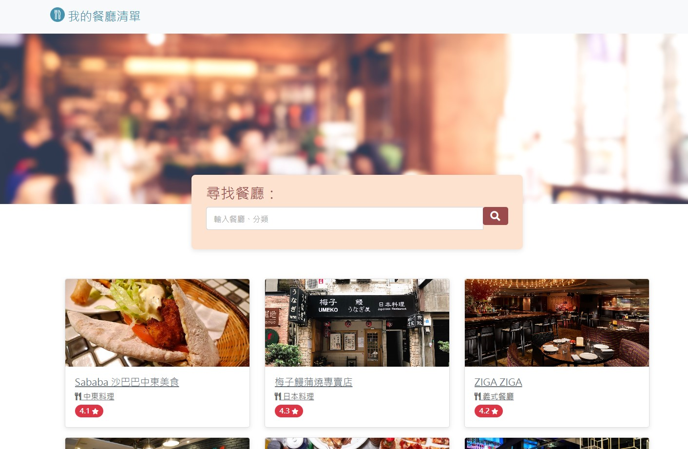

# 我的餐廳清單



## 介紹

一個屬於你的餐廳清單，不僅可以瀏覽餐廳、查看詳細資訊，還能直接連結到地圖!

### 功能

-一頁式查看餐廳
-瀏覽餐廳資訊
-關鍵字搜尋餐廳
-餐廳地址連結google地圖

# 如何開始

1.請先安裝 node.js 與 npm
2.將專案 clone 到本地

   ```
   git clone https://github.com/Tim2319/ACwork/tree/main/AC%20work
   ```

3. 在本地開啟之後，透過終端機進入資料夾，輸入：

   ```
   npm install
   ```

4. 安裝完畢後，繼續輸入：

   ```
   npm run start
   ```

5. 若看見此行訊息則代表順利運行，打開瀏覽器進入到以下網址

   ```
   Listening on http://localhost:3000
   ```

6. 若欲暫停使用

   ```
   ctrl + c
   ```

## 開發工具

- Node.js v18.15.0
- Express 4.18.2
- Express-Handlebars 7.1.2
- Bootstrap 5.2.1
- Font-awesome 5.8.1